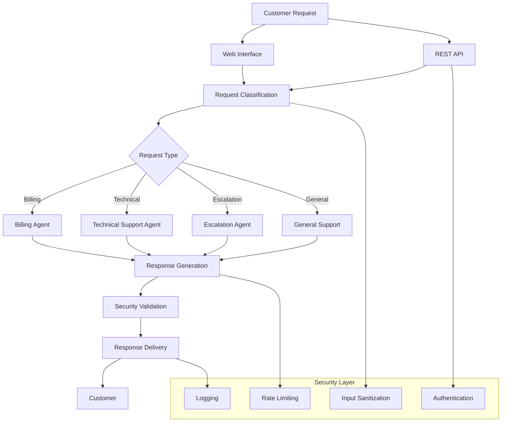

# CrewAI Multi-Agent Customer Support Desk

A comprehensive customer support system built with CrewAI that uses multiple specialized agents to handle different types of customer inquiries efficiently and securely.

## 🚀 Features

- **Multi-Agent Architecture**: Specialized agents for billing, technical support, and escalations
- **Intelligent Routing**: Automatic request classification and routing to appropriate agents
- **Security-First Design**: Input sanitization, rate limiting, and authentication
- **Modern Web Interface**: Streamlit-based user interface with real-time status monitoring
- **REST API**: FastAPI backend with comprehensive endpoints
- **Comprehensive Logging**: Detailed interaction tracking and audit trails
- **Emergency Handling**: Special protocols for urgent situations

## 📋 Table of Contents

- [Architecture Overview](#architecture-overview)
- [Installation](#installation)
- [Configuration](#configuration)
- [Usage](#usage)
- [API Documentation](#api-documentation)
- [Security Features](#security-features)
- [Contributing](#contributing)
- [License](#license)

## 🏗️ Architecture Overview



## 🛠️ Installation

### Prerequisites

- Python 3.8 or higher
- OpenAI API key
- Git

### Setup Instructions

1. **Clone the repository**
   ```bash
   git clone https://github.com/yourusername/crewAi-MA_customer_support_desk.git
   cd crewAi-MA_customer_support_desk
   ```

2. **Create virtual environment**
   ```bash
   python -m venv venv
   source venv/bin/activate  # On Windows: venv\Scripts\activate
   ```

3. **Install dependencies**
   ```bash
   pip install -r requirements.txt
   ```

4. **Set up environment variables**
   ```bash
   cp env_example.txt .env
   # Edit .env with your configuration
   ```

5. **Configure your settings**
   - Add your OpenAI API key to `.env`
   - Set your secret key for JWT authentication
   - Configure other settings as needed

## ⚙️ Configuration

### Environment Variables

Create a `.env` file with the following variables:

```env
# OpenAI Configuration
OPENAI_API_KEY=your_openai_api_key_here

# Security Configuration
SECRET_KEY=your_secret_key_here
ALGORITHM=HS256
ACCESS_TOKEN_EXPIRE_MINUTES=30

# Database Configuration
DATABASE_URL=sqlite:///./customer_support.db

# Logging Configuration
LOG_LEVEL=INFO
LOG_FILE=logs/customer_support.log

# Rate Limiting
RATE_LIMIT_PER_MINUTE=60

# CrewAI Configuration
CREWAI_VERBOSE=True
CREWAI_MEMORY=True
```

## 🚀 Usage

### Starting the API Server

1. **Start the FastAPI backend**
   ```bash
   python api/main.py
   ```
   The API will be available at `http://localhost:8000`

2. **Start the web interface**
   ```bash
   streamlit run web_interface/app.py
   ```
   The web interface will be available at `http://localhost:8501`

### Using the Web Interface

1. Open your browser and navigate to `http://localhost:8501`
2. Enter your customer ID (optional)
3. Select your request type or use auto-detect
4. Describe your issue in detail
5. Submit your request
6. Receive response from the appropriate specialized agent

### Using the API Directly

```python
import requests

# Example API call
headers = {
    "Authorization": "Bearer your-token-here",
    "Content-Type": "application/json"
}

data = {
    "message": "I have a billing question about my invoice",
    "customer_id": "customer123",
    "emergency": False,
    "context": {
        "request_type": "billing",
        "timestamp": "2024-01-01T12:00:00Z"
    }
}

response = requests.post(
    "http://localhost:8000/support/request",
    headers=headers,
    json=data
)

print(response.json())
```

## 📚 API Documentation

### Endpoints

#### POST `/support/request`
Handle general customer support requests with automatic routing.

**Request Body:**
```json
{
    "message": "string",
    "customer_id": "string (optional)",
    "context": "object (optional)",
    "emergency": "boolean"
}
```

#### POST `/support/billing`
Handle billing-specific requests directly.

#### POST `/support/technical`
Handle technical support requests directly.

#### POST `/support/escalation`
Handle escalation and complaint requests directly.

#### POST `/support/complex`
Handle complex requests requiring multiple agents.

#### GET `/support/status`
Get the current status of all agents.

### Response Format

```json
{
    "response": "Agent's response message",
    "agent_type": "billing|technical|escalation|auto_routed",
    "timestamp": "2024-01-01T12:00:00Z",
    "case_id": "string (optional)"
}
```

## 🔒 Security Features

### Input Validation
- Input sanitization to prevent injection attacks
- Length limits on user messages
- Dangerous character filtering

### Authentication
- JWT token-based authentication
- Token expiration handling
- Secure token verification

### Rate Limiting
- Per-customer rate limiting
- Configurable limits (default: 60 requests/minute)
- Automatic rate limit enforcement

### Logging & Monitoring
- Comprehensive interaction logging
- Security event tracking
- Audit trail maintenance

### Data Protection
- No sensitive data storage in logs
- Secure context handling
- Customer privacy protection

## 🤖 Agent Specializations

### Billing Agent
- **Expertise**: Payment processing, invoices, refunds, subscriptions
- **Capabilities**: 
  - Payment issue resolution
  - Invoice generation and management
  - Refund and credit procedures
  - Subscription management
  - Billing dispute resolution

### Technical Support Agent
- **Expertise**: Software installation, troubleshooting, performance optimization
- **Capabilities**:
  - Software installation and configuration
  - Error troubleshooting and bug resolution
  - Performance optimization
  - Network and connectivity issues
  - Feature guidance and tutorials

### Escalation Agent
- **Expertise**: Complex complaints, policy disputes, emergency situations
- **Capabilities**:
  - Complex complaint resolution
  - De-escalation and conflict management
  - Policy interpretation and exceptions
  - Emergency situation handling
  - Customer satisfaction recovery

## 📊 Monitoring & Analytics

### Agent Status Monitoring
- Real-time agent activity tracking
- Interaction count monitoring
- Performance metrics

### Request Classification
- Automatic request categorization
- Routing efficiency tracking
- Response time monitoring

### Security Monitoring
- Suspicious activity detection
- Rate limit violation tracking
- Authentication failure logging

## 🧪 Testing

### Running Tests
```bash
# Run all tests
python -m pytest tests/

# Run specific test categories
python -m pytest tests/test_agents.py
python -m pytest tests/test_api.py
python -m pytest tests/test_security.py
```

### Test Coverage
```bash
# Generate coverage report
python -m pytest --cov=. --cov-report=html
```

## 🚨 Emergency Procedures

### Urgent Situations
1. Check the emergency checkbox in the web interface
2. Use escalation endpoints for immediate attention
3. Contact human agents for critical issues

### Security Incidents
1. Monitor logs for suspicious activity
2. Implement additional rate limiting if needed
3. Escalate to security team for serious incidents

## 🔧 Troubleshooting

### Common Issues

**API Connection Errors**
- Verify the API server is running
- Check firewall settings
- Ensure correct port configuration

**Authentication Errors**
- Verify JWT token is valid
- Check token expiration
- Ensure correct secret key configuration

**Agent Response Issues**
- Check OpenAI API key configuration
- Verify internet connectivity
- Review agent configuration settings

### Log Files
- Application logs: `logs/customer_support.log`
- API logs: Check console output
- Web interface logs: Streamlit console

## 🤝 Contributing

1. Fork the repository
2. Create a feature branch (`git checkout -b feature/amazing-feature`)
3. Commit your changes (`git commit -m 'Add amazing feature'`)
4. Push to the branch (`git push origin feature/amazing-feature`)
5. Open a Pull Request

### Development Guidelines
- Follow PEP 8 style guidelines
- Add comprehensive docstrings
- Include unit tests for new features
- Update documentation as needed

## 📄 License

This project is licensed under the MIT License - see the [LICENSE](LICENSE) file for details.

## 🙏 Acknowledgments

- [CrewAI](https://github.com/joaomdmoura/crewAI) for the multi-agent framework
- [FastAPI](https://fastapi.tiangolo.com/) for the web framework
- [Streamlit](https://streamlit.io/) for the web interface
- [OpenAI](https://openai.com/) for the language models

## 📞 Support

For support and questions:
- Create an issue in the GitHub repository
- Contact the development team
- Check the documentation for common solutions

---

**Note**: This is a demonstration project. For production use, ensure proper security measures, data protection, and compliance with relevant regulations.